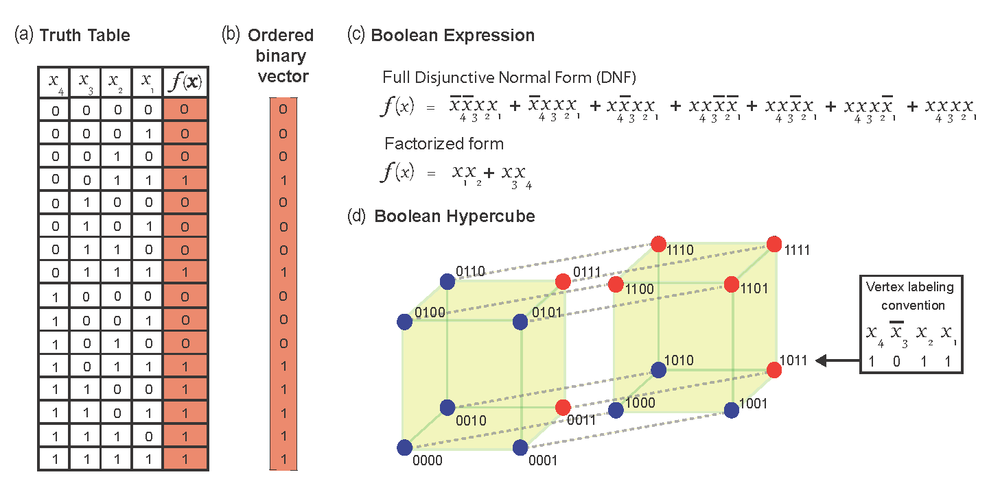

# About

BF_checkers.py checks if a BF(Boolean function) is an EF (Effective function), UF (Unate function), CF (Canalyzing function) or NCF (Nested canalyzing function).



Instances:
Enter the number of inputs and BF truth table as a binary string. The string from left to right is the output of the truth table from the top to bottom.
https://github.com/asamallab/MCBF/blob/80ae287c0ae59e5be7148caad1ecfb1d6e9c213a/BF_codes/BF_checkers.py
```python
>>> check_if(3,'10001010').is_EF()
True

>>> check_if(3,'00001011').is_CF()
True

>>> check_if(3,'00001011').is_UF()
'aai' # 'a':activator and  'i': inhibitor

>>> check_if(3,'00001011').conforms_to_edge_signs('aai')
True

>>> check_if(3,'11001011').is_NCF()
False
```

BF_generator.py generates all BFs belogning to a particular type of BF: EF, UF, CF and NCF.

Instances:

```python
>>> generate(1).all_BF()
['00', '01', '10', '11']

>>> generate(1).all_EF()
['01', '10']

>>> generate(2).UF_with_sign('ai')
['0000', '0010', '0011', '1010', '1011', '1111']

>>> generate(2).all_signs_UF()
['1000', '1110', '0010', '1011', '0100', '1101', '0001', '0111']

>>> generate(2).all_CF()
['0000', '0001', '1110', '0010', '1111', '0011', '1010','0111', '1100', '1000', '0100', '1101', '1011', '0101']

>>> generate(2).all_NCF()
['0001', '1110', '0010', '0111', '1000', '0100', '1101', '1011']
```

BF_properties.py is used to get various aspects of BFs such as average sensitivity, it's permutations, dnf or cnf expressions (both 'full' and 'Quine-McCluskey minimized' expressions) among others.

```python

>>> bf(3, '10000101').avg_sensitivity() 
1.75

>>> bf(3, '11100000').is_cana_in_input(3)
'1'

>>> bf(3, '11001010').right_shift() #returns a single 'right' cyclic permutation of the  truth table
'11100100'

>>> bf(3, '11100000').swap_rows([1,3]) #negates the inputs 1 and 3
'00001101'

>>> bf(3, '11100000').all_perms()
['10101000', '11001000', '11100000']

>>> bf.logic_operation('1001', '1010', 0) # Combines the BFs '1001' and '1010' with the '0' (AND) operator
'1010000000001010'

>>> bf(3,'10001010' ).get_dnf()
{'full_DNF': '(~a & ~b & ~c) | (a & ~b & ~c) | (a & b & ~c)', 'QM-DNF': (a & ~c) | (~b & ~c)}

>>> bf(3,'10001010' ).get_cnf()
{'full_CNF': '(a | b | ~c) & (a | ~b | c) & (a | ~b | ~c) & (~a | b | ~c) & (~a | ~b | ~c)', 'QM-CNF': ~c & (a | ~b)}
```

In case you use the codes or data or catalog herein, please cite the reference given below:

## CITATION
A. Subbaroyan, O.C. Martin, A. Samal. Minimum complexity drives regulatory logic in Boolean models of living systems.
