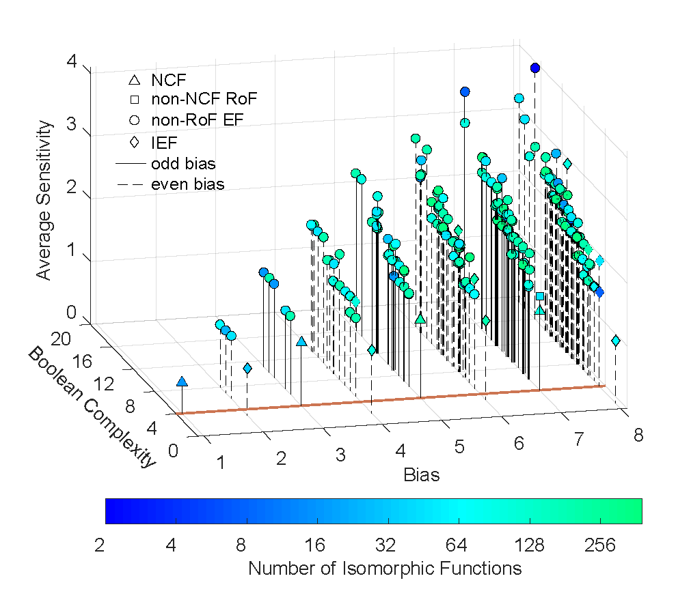

# Boolean Complexity

## Definition
The Boolean complexity is the number of literals in the minimal equivalent expression of a Boolean functions as obtained by the factorization of the Booelan function.

## Procedure to compute the Boolean complexity

We use the software 'ABC: System for Sequential Logic Synthesis and Formal Verification' to factorize a Boolean expression. The link to this software is : https://github.com/berkeley-abc/abc (The ABC version used is 1.01, and was compiled on 21-07-2021)

An instance of a BF (repBF_032) is used to explain the procedure to it's obtain it's Boolean complexity. Here repBF_032 is one of the representative Boolean functions of a 4-input Boolean function.

1. Download the ABC software.

2. Generate 4 different kinds of expressions for the Boolean function, namely: the full_DNF, full_CNF, Quine McCluskey minimized DNF (qm_DNF) and Quine McCluskey minimized CNF (qm_CNF) using bf.get_cnf() and bf.get_dnf() functions in BF_codes/BF_properties.py (The Sympy module is used to obtain the Quine McCluskey minimized expression).

3. Convert them to the .eqn format (see files in the input_BF folder).

4. Run the abc_code.sh shell script to four obtain minimized expression, each corresponding to one kind of expression. This file is stripped of the first two lines to leave only the minimized Boolean expression in the output (see files in the output_BF folder).

5. Finally, count the number of literals in each of the Boolean expressions in the .eqn files in the output_file. The expression with the minimum number of literals is taken to be the minimum expression. The number of literals in this expression is taken to be the Boolean complexity.

This procedure is used to obtain the minimal expression and Boolean complexity of all representative 4-input Boolean functions. The Booleancomplexity, along with the average sensitivity is given in the file k4_rep_BFs.tsv. 

### Bias vs Boolean complexity vs Average sensitivity
Below is a plot of the variation of the average sensitivity and Boolean complexity of 4-input 'representative' Boolean functions with the bias. Number of isomorphic functions are the number of functions which can be obtained by permutation and negation of the input variables of the Boolean function.

