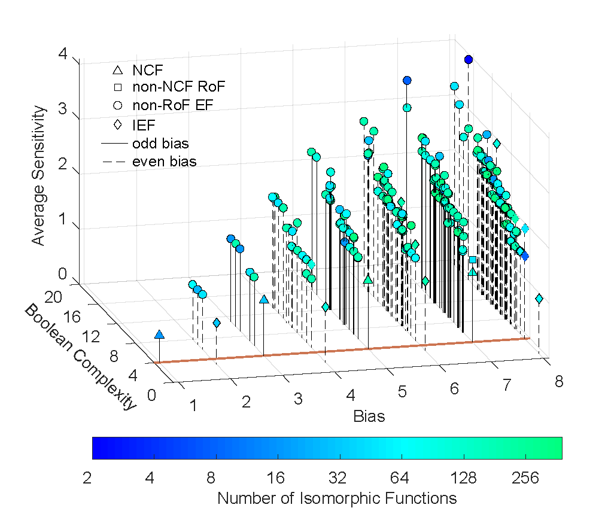

# MCBF

## About
MCBF stands for Minimum Complexity Boolean Functions. Throughout this repository the acronyms for the various types of biologically meaningful functions are EF (Effective function), UF (Unate function), CF (Canalyzing function), NCF (Nested canalyzing function) and RoF (Read-once function).

### Bias vs Boolean complexity vs Average sensitivity
Below is a plot of the variation of the average sensitivity and Boolean complexity of 4-input 'representative' Boolean functions with the bias. Number of isomorphic functions are the number of functions which can be obtained by permutation and negation of the input variables of the Boolean function.

In case you use the codes or data or catalog herein, please cite the reference given below: 

## CITATION
A. Subbaroyan, O.C. Martin, A. Samal. Minimum complexity drives regulatory logic in Boolean models of living systems. 
