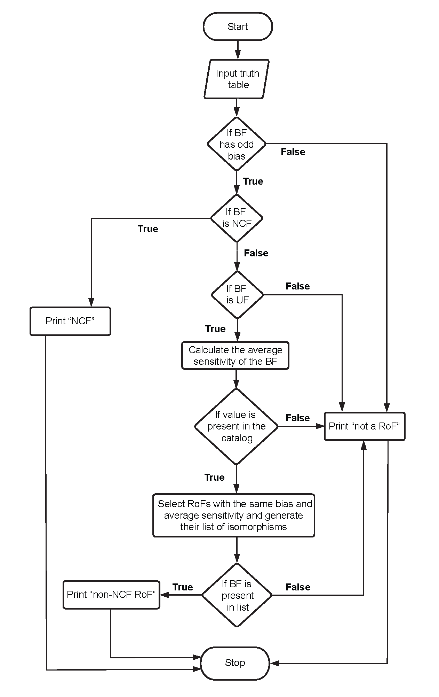

# RoF: Read-once functions

If the Boolean expression consists exactly of *k* variables, one corresponding to each of it's *k* inputs, and consists only of the operators AND, OR and NOT, then the associated Boolean function (BF) is a Read-once function (RoF).

### Folder Structure
There are 3 files in this folder:
  1. RoF_catalog: This folder contains 10 files labeled RoF_cat_XX.tsv, where X takes values 0 to 9. 'XX' refers to the number of input variables (*k*) of the RoF. Each file contains the representative RoFs (up to <bias img src="https://render.githubusercontent.com/render/math?math=2^{*k*-1}">) and their properties such as:
       * decimal_rep: integer encoding of the RoF
       * bias: Hamming weight of the RoF
       * avg_sensitivity: average sensitivity
       * CF: whether the RoF is canalyzing
       * NCF: whether the RoF is nested canalyzing
       * cana_depth: canalyzing depth of the RoF
       * expressions: the Boolean expression of the RoF
       * isomorphisms: all permutations and negations of the inputs of the RoF
  
  2. RoF_checker.py: Program to check if a BF is a RoF (This program makes use of RoF_catalog as a look-up table to check for RoFs).
     ```python
      >>> is_RoF (3, '11001101')
      'The BF is not a RoF'
     ```
  
  3. RoF_generator.py: Program to generate all the representative RoFs for a given number of inputs. 
     ```python
      >>> generate_RoFs(3)
      ['00000001', '00000111', '00011111', '01111111'] # All representative RoFs for 3 inputs
     ```
  

### Flowchart of the RoF_checker algorithm

  

### CITATION
In case you use the codes or catalog herein, please cite the following reference:<br/>
*Minimum complexity drives regulatory logic in Boolean models of living systems*. Ajay Subbaroyan, Olivier C. Martin, Areejit Samal, bioRxiv 2021.09.20.461164; doi: https://doi.org/10.1101/2021.09.20.461164
